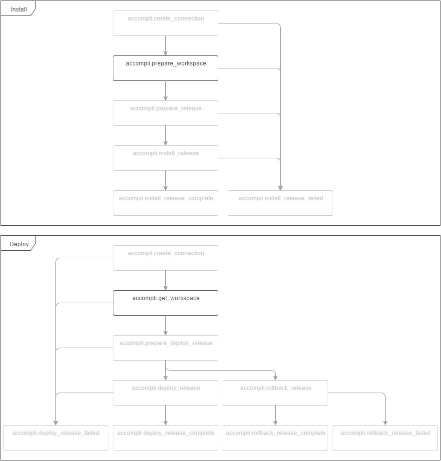

# CreateWorkspaceTask

Creates a Workspace instance and creates the workspace directory structure on a host.

## Configuration options

| Name | Type | Default value | Description |
|------|------|---------------|-------------|
| releasesDirectory | string | releases/ | The directory where all the releases are installed. |
| dataDirectory | string | data/ | The directory for storing user data. |
| cacheDirectory | string | cache/ | The directory for storing cache files. |
| otherDirectories | string[] |  | Array of additional directories to be created. |

## Event flow

