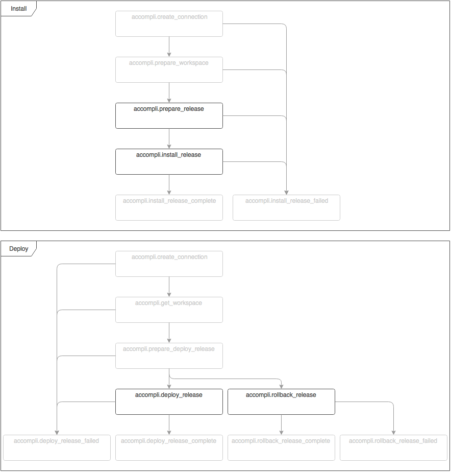

# ExecuteCommandTask

This task executes a configured command during the one or more configured events: AccompliEvents::PREPARE_RELEASE,
AccompliEvents::INSTALL_RELEASE, AccompliEvents::DEPLOY_RELEASE and/or AccompliEvents::ROLLBACK_RELEASE.

The working directory for AccompliEvents::PREPARE_RELEASE during execution of the command is the workspace.
For all other events the directory of the release being installed or deployed is the working directory.

## Configuration options

| Name | Type | Default value | Description |
|------|------|---------------|-------------|
| events | string[] |  | The events to execute the command on. Valid values are 'accompli.prepare_release', 'accompli.install_release', 'accompli.deploy_release' and/or 'accompli.rollback_release'. |
| command | string |  | The command to be executed. |
| arguments | string[] |  | The arguments and options to be passed to the command upon execution. |

## Event flow

