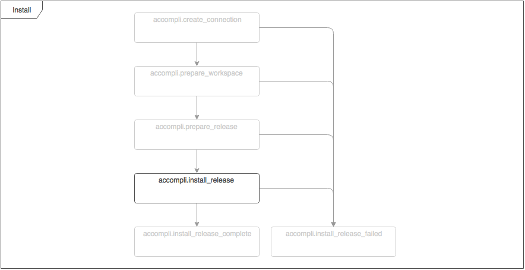

# FilePermissionTask

Updates the permissions of the configured files and directories.

## Configuration options

| Name | Type | Default value | Description |
|------|------|---------------|-------------|
| paths | array |  | The paths for which you want to update the permissions. |

### Configure the permissions for directories
Example configuration:
```json
{
    "class": "Accompli\\Task\\FilePermissionTask",
    "paths": {
        "directory/within/release": {
            "recursive": true,
            "permissions": "-rwxrwx---"
        },
        "another/directory/within/release": {
            "recursive": true,
            "permissions": "-rwxrwxrwx"
        }
    }
}
```

Foreach directory permissions can be set by adding a permissions key to the configured path. Serveral variations for the value are:
`-rwx`, `rwxrwx`, `-rwxrwxr`. The `-` at the beginning is optional, so are the rest of the characters at the end.

Configuring `-rwx` will result in setting the following permissions `-rwx------`. It is advisible to configure the full 10 characters because this makes it easier for others to understand what permissions are set.

### Configure recursiveness
It's also possible to set the permissions of all subdirectories of the configured path by setting the key `recursive` to true. This configuration setting is optional because the default setting is false.

# Event flow

