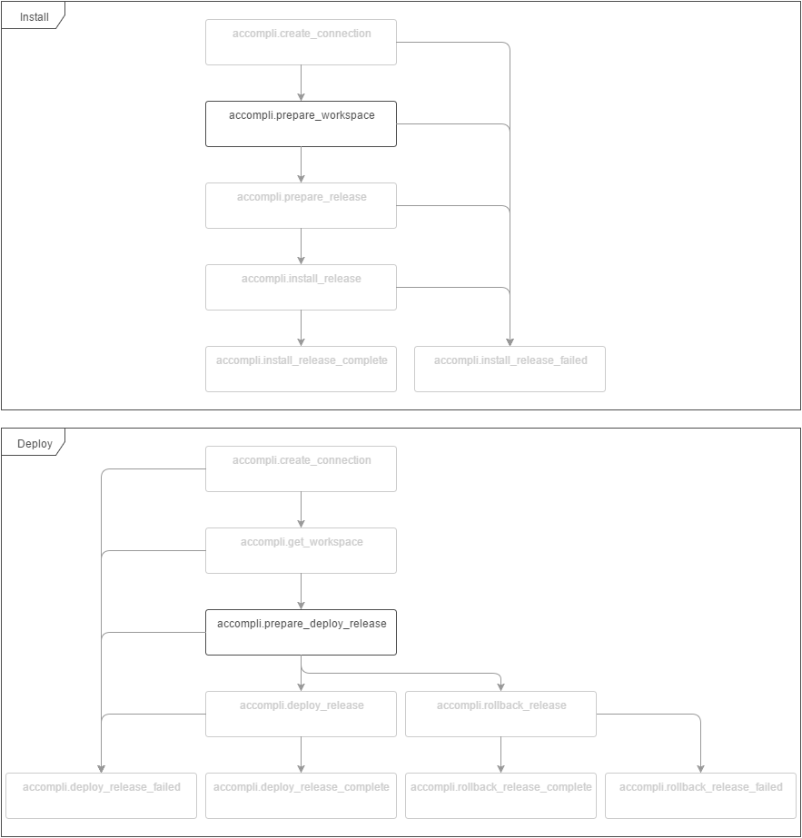

# MaintenanceModeTask

Uploads the maintenance page to the workspace and links the maintenance page to the specified stage based on the configured strategy.

## Configuration options

| Name | Type | Default value | Description |
|------|------|---------------|-------------|
| strategy | string | major_difference | The strategy specifying when to link the maintenance page. The strategy must be one of the following options:<ul><li>major_difference - Link the maintenance page on a major version change.</li><li>minor_difference - Link the maintenance page on a major or minor version change.</li><li>always - Always link the maintenance page.</li></ul> |

# Event flow

