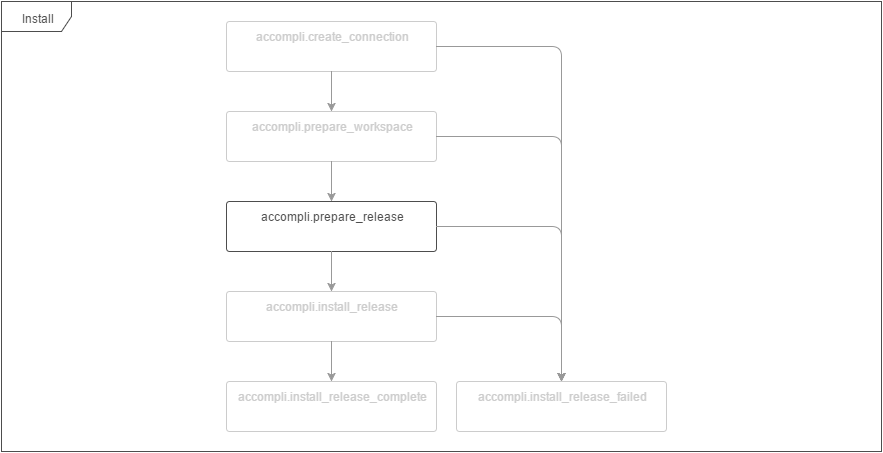

# RepositoryCheckoutTask

Creates a branch or tag checkout from the configured VCS repository in the releases directory.

# Configuration options

| Name | Type | Default value | Description |
|------|------|---------------|-------------|
| repositoryUrl | string |  | The URL to the VCS repository. |

# Event flow

